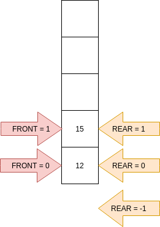

# Data Structures

## Stack

- Linear abstract data structure where the elements could be added or deleted only at one open end called the top of the stack.
- The elements follows **Last In First Out Order**, typically called **LIFO**.
- Insertion into the stack is called **push** operation and deletion from the stack is called **pop** operation.
- If the stack is full it is said to be in **Overflow** state, and push is rejected if stack is overflow.
- If the stack is empty it is said to be in **Underflow** state, and pop is rejected if stack is underflow.


### Stack used

- Undo
- Back button in web browser
- Terminal history

### Implementation of Stack using 1-D array

```
top = -1; // initial value
top = holds last index insertion take place

size = 5; // size of array, top [0,4]

push first check size of array
push 6 th time will fail with overflow
```

**push algorithm**

```
1. PROCEDURE PUSH(v)
2. IF TOP := SIZE - 1 THEN
3.	DISPLAY "STACK OVERFLOW"
4.	EXIT PUSH
5. END IF
6. TOP := TOP + 1 // increment the top of the stack S by 1
7. S[TOP] := v	  // assign the element at the top position of the stack
8. END PROCEDURE PUSH
```

**pop algorithm**

```
1. PROCEDURE POP()
2. IF S.TOP = -1 THEN
3.	DISPLAY "STACK UNDERFLOW"
4. 	EXIT POP
5. END IF
6. v := S[TOP]
7. TOP := TOP - 1
8. RETURN v
9. END PROCEDURE POP
```

```
gcc main.c -o main
./main
```

### Reverse content of file

**reverse algorithm**

```
Data Structure needed: stack of characters.
Algorithm:
1. Go on reading characters from source file until End-of-file is reached.
2. PUSH Each character read into the stack.
3. When done, POP characters from the stack and write them into the destination file until stack is underflow.
```

### Match parenthesis

```
[{(a+b)*c}/a]	well formed
{(a+b)/c]	bad formed

{(a+b)/c]	)a + b(
AA   A		A
||   |		|
||   |		|
   check	error stop scanning
   stack


Opening bracket to stack
Closing bracket check stack
```


**match parenthesis algorithm**

```
error = FALSE

while Not end of the expression
  next_char = next character of input expression
  if next_char == '(' OR next_char == '{' OR next_char == '[' then
    push(STACK, next_char)
  else if next_char == ')' OR next_char == '}' OR next_char == ']' then
    if isEmpty(STACK) then
      error = TRUE
      break while
    else if isOpeningMatch(stacktop(STACK), next_char) then
      pop(STACK)
    else
      error = TRUE
      break while
    end if
  end if
end while

if !error and !isEmpty(STACK) then
  error = TRUE
end if

if error then
  print "The input expression does not contain well formed brackets"  
else
  print "The input expression is well formed"
end if
```

### Polish notation

```
(a+b)*c		// infix 

a+b ---> +ab	// prefix, Polish notation
a+b ---> ab+  // postfix, reverse Polish notation

// prefix, Polish notation
(a+b)*c	==> +ab*c  ==> r*c ==> *rc ==> *+abc

// postfix, reverse Polish notation
(a+b)*c ==> ab+*c ==> r*c ==> rc* ==> ab+c*
```

```
a*b+c
() - highest precidence
*,/
+,-

a*b/c		L -> R precidence
a-b+c		L -> R

a^b			exponential
a$b

a*b$(c-d)/k$p
a*b$-cd/k$p
a*$b-cd/k$p
a*$b-cd/$kp		r1 = $b-cd		r2 = $kp		
a*r1/r2
*ar1/r2
/*ar1r2

/*a$b-cd$kp		prefix notation
<------------
```

### Evaluate Polish or Reverse Polish notations

```
24+32-*
632-*
61*
6
```

**evaluate algorithm**

```
2 							---> push to stack
4 							---> push to stack
operand1 = 4.0
+
operand2 = 2.0
					 6.0	---> push to stack
3								---> push to stack
2								---> push to stack
operand1 = 2.0
-
operand2 = 3.0
					 1.0 ---> push to stack
operand1 = 1.0
*
operand2 = 6.0 
					 6.0 ---> push to stack
```

```
initialize(stack)
while not end of the postfix string:
	next_token = get the next token from postfix string
	if next_token is an operand then
		push(stack, next_token)
	else if next_token is an operator then
		opnd1 = pop(stack)
		opnd2 = pop(stack)
		result = operate (opnd2, opnd1, next_token)
		push(stack, result)
	end if

end while

print pop(stack)
```

**postfix compile**

```console
gcc postfix_eval.c -lm -o postfix_eval
```

### Invert Infix to Postfix

```
infix: 		a*(b+c)
postfix: 	a*bc+
					abc+*
```

- While converting to postfix, operands in infix do not change their position in postfix. However, operators
are rearranged according to their precedence
- Keep operators on the stack
- If the stack is empty and you have an operator then just push it into the stack


## Algorithm converting Infix to Postfix

- Arrays:
	- infix - to hold the infix string
	- postfix - to hold the postfix string, initially empty

- Other Data structure:
	- OperatorStack - top is initialized and push and pop operation works on this

**ALGORITHM**

```
WHILE NOT END OF INFIX STRING:
	TOKEN = GET THE NEXT ELEMENT FROM INFIX STRING
	IF TOKEN IS AN OPERRAND THEN
		APPEND TOKEN WITH POSTFIX STRING
	ELSE IF TOKEN IS AN OPERATOR THEN
		WHILE NOT EMPTY OPERATORSTACK AND PRCD(STACKTOP, TOKEN):
			TOP_OPERATOR = POP(OPERATORSTACK)
			APPEND TOP_OPERATOR WITH THE POSTFIX STRING
		END WHILE
		IF TOKEN = ')' THEN
			POP (OPERATORSTACK)
		ELSE
			PUSH(OPERATORSTACK, TOKEN)
		END IF
	END IF
END WHILE

WHILE NOT EMPTY OPERATORSTACK:
	TOP_OPERATOR = POP(OPERATORSTACK)
	APPEND TOP_OPERATOR WITH THE POSTFIX STRING
END WHILE

PRINT POSTFIX
```

## Queue

- FIFO - First In First Out
- Implementing array

- Queue is a linear data structure with two open ends, called the 'rear' and 'front', elements are added at the 'rear'
end and deleted from the 'front' end.
- Elements in a Queue typically follows 'First In First Out' order, that is element inserted first will be always
deleted first.

- Some other variations of Queue DS:
	- Double ended queue.
	- Priority Queue.


- Queue is empty - This will happen when rear and front are at the same index.
- Insertion to queue - ENQUEUE
- Deletion from queue - DEQUEUE

### Algorithm for FIFO Queue using 1-D array

```
REAR : is an integer variable to hold the index of the rear end of Queue, that is
			 	the index of the next insertion element.

FRONT : is an integer variable to hold the index of the front end of Queue, that is
				the index of the next element to be deleted.

ITEM[SIZE] : is and 1-D array that we will be using for keeping the queue elements
							SIZE is the size of the Queue, that is the number of elements in the array.
							We consider tha index of the array starts from 0. 

Initially:
						REAR = 0
						FRONT = 0
```

```
OPERATION ENQUEUE(V):
	IF REAR == SIZE THEN
		PRINT "QUEUE OVERFLOW"
		EXIT ENQUEUE
	END IF

	ITEM[REAR] = V
	REAR = REAR + 1
END ENQUEUE

OPERATION DEQUEUE:
	IF REAR == FRONT THEN
		PRINT "QUEUE UNDERFLOW"
		EXIT DEQUEUE
	END IF

	V = ITEM[FRONT]
	FRONT = FRONT + 1
	RETURN V
END DEQUEUE
```

### Circural queue


**Algorithm**

```
IF R == F
	QUEUE IS UNDERFLOW

IF ((R + 1) % SIZE == F) 
	QUEUE OVERFLOW
```

**Algorithm for enqueue and dequeue operations for a Circular Queue**

```
Initially:
ITEM IS AN 1-D ARRAY TO HOLD THE ENQUEUE ELEMENTS
REAR = SIZE - 1
FRONT = SIZE -1

OPERATION ENQUEUE(V):
	IF (REAR + 1) % SIZE == FRONT THEN
		PRINT "QUEUE OVERFLOW"
		EXIT ENQUEUE
	END IF
	REAR = (REAR + 1) % SIZE
	ITEM[REAR] = V
END ENQUEUE	

OPERATION DEQUEUE:
	IF REAR == FRONT THEN
		PRINT "QUEUE UNDERFLOW"
		EXIT DEQUEUE
	END IF
	FRONT = (FROMT + 1) % SIZE
	V = ITEM[FRONT]
	RETURN V
END DEQUEUE
```

### Double ended queue

```
1. Insertion at REAR
2. Deletion from REAR
3. Insertion at FRONT
4. Deletion from FRONT
```



**Algorithm insertion deletion**

```
FRONT = 0
REAR = -1

PROCEDURE INS_AT_REAR:
	IF REAR == SIZE - 1 THEN
		PRINT "UNABLE TO ADD AT REAR"
		EXIT INS_AT_REAR
	END IF
	REAR = REAR + 1
	ITEM[REAR] = V
END OF INS_AT_REAR


PROCEDURE DEL_FROM_REAR:
	IF FRONT > REAR THEN
		PRINT "QUEUE UNDERFLOW"
		EXIT DEL_FROM_REAR
	END IF
	V = ITEM[REAR]
	REAR = REAR - 1
	RETURN V
END OF DEL_FROM_REAR


PROCEDURE INS_AT_FRONT(V):
	IF FRONT == 0
		PRINT "UNABLE TO INSERT AT FRONT"
		EXIT INS_AT_FRONT
	END IF
	FRONT = FRONT - 1
	ITEM[FRONT] = V
END OF INS_AT_FRONT


PROCEDURE DEL_FROM_FRONT:
	IF FRONT > REAR THEN
		PRINT "QUEUE UNDERFLOW"
		EXIT DEL_FROM_FRONT
	END IF
	V = ITEM[FRONT]
	FRONT = FRONT + 1
	RETURN V
END OF DEL_FROM_FRONT
```

## Linked List

```
The drawbacks of arrays are removed in linked list at the cost of the benefit of having an array.
```

**Problem with arrays**

- The size of array.
- Once allocated with size it is a hazard to change the size of the array in runtime.
- Insertion and deletion operation at any point between the first and the last index of the existing elements.
- Adding a new element or deleting an existing element is independent to number of elements in the linked list, no shifting
kind of activities like array are required.

**Structure of linked list**

- Linked list is dynamic, created on "as and when required basis".
- You do not need to mention the size when you create a linked list.
- Programmers need to write functions for linked list operations such as inserting and deleting an element, searching and other
necessary DS operations.


**Singly linked list**

**Circular linked list**


**Doubly linked list**


